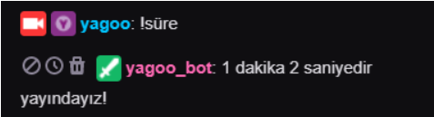
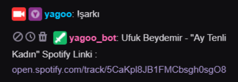
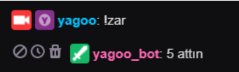

# Twitch-Bot-React-Version
React version of Twitch Bot (https://github.com/yagizdo/Twitch-ChatBot).

# Twitch-Bot
Twitch Bot with tmi.js and Node.js.

English Information
--------------------

***Proporties***

!title = Change the stream title with this command.
 
 

!game = Change stream name with this command.
 
 

!süre = You can learn the broadcasting time with this command.
> Example ScreenShot : 

 
 
!sarki = On chat display shows the song currently playing via spotify.
> Example ScreenShot : 

 
 
!zar = You can roll the dice with this command.
> Example ScreenShot : 
 

 
 
 
 

Sub Command : When someone sub, they will write private messages on the chat.
 
Example : yagoo thanks for subscription. Welcome Family <3
 
Example ScreenShot : Soon :)
 
 

Resub Command : When someone re-subscribes, they will write private messages on the chat.
 
Example : yagoo thanks for x month subscription.
 
Example ScreenShot : Soon :)
 
 
 
 

Türkçe Bilgilendirme
---------------------

***Özellikler***

!title = Bu komut ile yayin basligini degistirebilirsiniz.
 
 
!game = Bu komut ile yayin oyununu degistirebilirsiniz.
 
 
!süre = Bu komut ile yayin süresini ögrenebilirsiniz. 
> Örnek Ekran Görüntüsü : 

 
 
!sarki = Bu komut ile o an spotify da çalan sarkiyi chatte görebilirsiniz.
> Örnek Ekran Görüntüsü : 

 
 
!zar = Bu komut ile zar atabilirsiniz.
> Örnek Ekran Görüntüsü : 

 
 
Sub Command : Birisi abone oldugunda chatte ona mesaj yazar.
 
Yazi örnegi : yagoo Abone oldugun için tesekkür ederim. Aileye hosgeldin <3
 
Örnek Ekran Görüntüsü : Yakinda :)
 
 
Resub Command : Birisi yeniden abone oldugunda chatte mesaj yazar. 
 
Yazi örnegi : yagoo x aydir abone oldugun için tesekkür ederim canimsin.
 
Ekran görüntüsü : Yakinda :)
 
 
 
 
# Contributors
Yilmaz Yagiz Dokumaci - https://github.com/yagizdo
